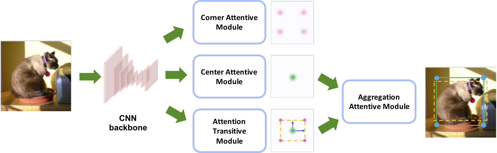

# SaccadeNet

The official implementation of *SaccadeNet: A Fast and Accurate Object Detector* accepted by the IEEE/CVF Conference on Computer Vision and Pattern Recognition (CVPR) 2020

*[Arxiv Link](https://arxiv.org/pdf/2003.12125.pdf)*
    

## Abstract 

Object detection is an essential step towards holistic scene understanding. Most existing object detection algorithms attend to certain object areas once and then predict the object locations. However, scientists have revealed that human do not look at the scene in fixed steadiness. Instead, human eyes move around, locating informative parts to understand the object location. This active perceiving movement process is called saccade. In this paper, inspired by such mechanism, we propose a fast and accurate object detector called SaccadeNet. It contains four main modules, the Center Attentive Module, the Corner Attentive Module, the Attention Transitive Module, and the Aggregation Attentive Module, which allows it to attend to different informative object keypoints actively, and predict object locations from coarse to fine. The Corner Attentive Module is used only during training to extract more informative corner features which brings free-lunch performance boost. On the MS COCO dataset, we achieve the performance of 40.4% mAP at 28 FPS and 30.5% mAP at 118 FPS. Among all the real-time object detectors, our SaccadeNet achieves the best detection performance, which demonstrates the effectiveness of the proposed detection mechanism.

## Main results

### Object Detection on COCO validation

| Backbone     |  AP / FPS | Flip AP / FPS|
|--------------|-----------|--------------|
|DLA-34        | 38.5 / 40.4 | 40.4 / 28  | 
|ResNet-18     | 30.5 / 118 | 32.5 / 67    | 

## Installation

Please refer to [INSTALL.md](readme/INSTALL.md) for installation instructions.

## Usage

We support demo for image/ image folder, video, and webcam. 

First, download the models (To be uploaded)

For object detection on images/ video, run:

~~~
python demo.py saccadedet --demo /path/to/image/or/folder/or/video --load_model ../models/saccadedet_coco_dla_2x.pth
~~~

For webcam demo, run     

~~~
python demo.py saccadedet --demo webcam --load_model ../models/saccadedet_coco_dla_2x.pth
~~~

You can add `--debug 2` to visualize the heatmap outputs.
You can add `--flip_test` for flip test.

To use this SaccadeNet in your own project, you can 

~~~
import sys
CENTERNET_PATH = /path/to/SaccadeNetNet/src/lib/
sys.path.insert(0, CENTERNET_PATH)

from detectors.detector_factory import detector_factory
from opts import opts

MODEL_PATH = /path/to/model
TASK = 'saccadedet' 
opt = opts().init('{} --load_model {}'.format(TASK, MODEL_PATH).split(' '))
detector = detector_factory[opt.task](opt)

img = image/or/path/to/your/image/
ret = detector.run(img)['results']
~~~
`ret` will be a python dict: `{category_id : [[x1, y1, x2, y2, score], ...], }`

## Benchmark Evaluation and Training

After [installation](readme/INSTALL.md), follow the instructions in [DATA.md](readme/DATA.md) to setup the datasets. Then check [GETTING_STARTED.md](readme/GETTING_STARTED.md) to reproduce the results in the paper.
We provide scripts for all the experiments in the [experiments](experiments) folder.

## Citation

    @InProceedings{Lan_2020_CVPR,
    author = {Lan, Shiyi and Ren, Zhou and Wu, Yi and Davis, Larry S. and Hua, Gang},
    title = {SaccadeNet: A Fast and Accurate Object Detector},
    booktitle = {Proceedings of the IEEE/CVF Conference on Computer Vision and Pattern Recognition (CVPR)},
    month = {June},
    year = {2020}
    }
